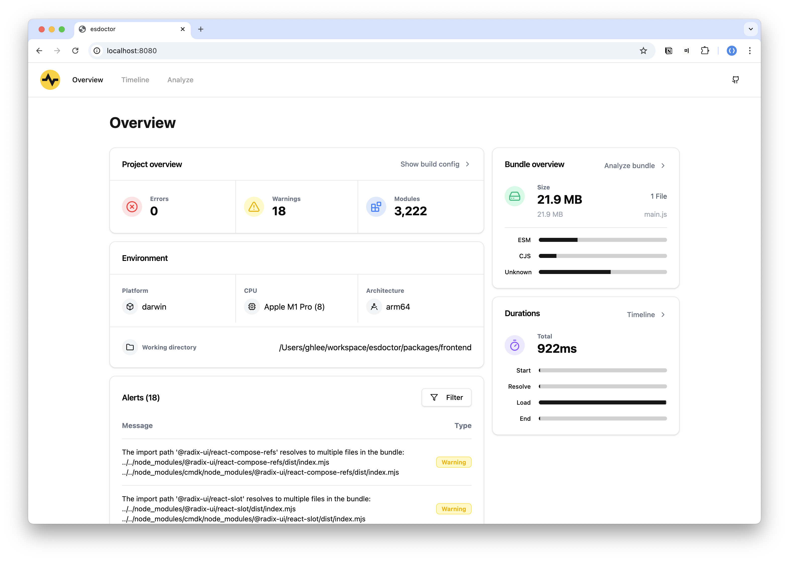
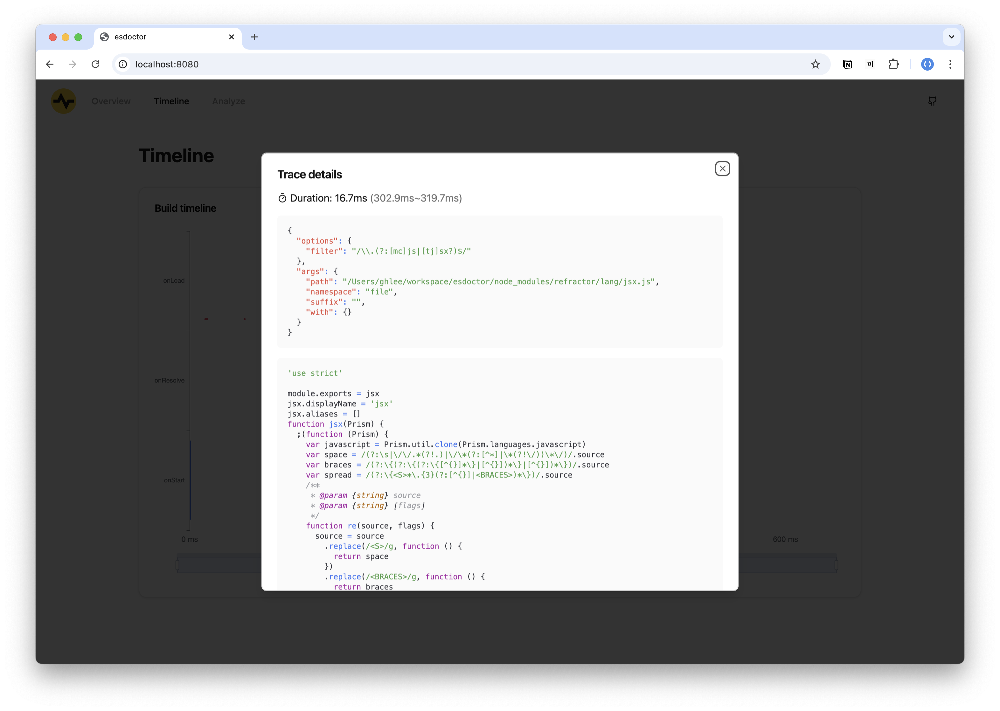
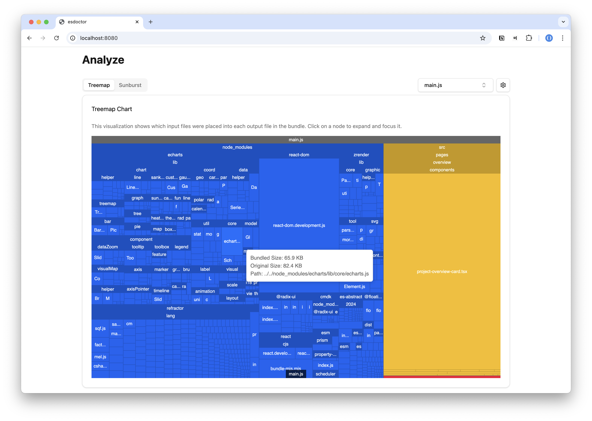

  <picture>
    <source media="(prefers-color-scheme: dark)" srcset="./images/logo-dark.svg">
    <source media="(prefers-color-scheme: light)" srcset="./images/logo-light.svg">
    
  </picture>

> [!NOTE]  
> Release coming soon.

# Features

- 🔥 Summary of project & build results
- 🔎 Trace each plugin hook performance
- ⭐️ Awesome visualization of collected data
  - 🌳 Treemap & Sunburst chart for bundles
  - 📈 Timeline chart for traces
- 🌍 Generate static HTML reports
- 🐤 Easy to use

## Preview

## License

[MIT](./LICENSE)
